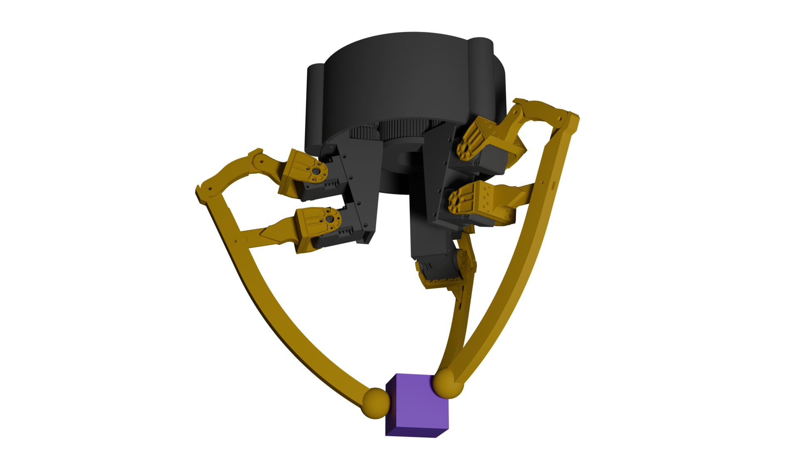

# D-PALI 3D
Weclome to our D-PALI 3D repo! This project was completed in 10 weeks as part of a module at Imperial College London.
## Project Brief
The aim of this project was to develop on the previous versions of [D-PALI](https://www.imperial.ac.uk/manipulation-touch/research/d-pali/) from the Manipulation and Touch Lab at Imperial College London. 

The basis for the D-PALI robot was to create a gripper cappable of achieving dextours in hand manipulation, whilst minimising overall cost. We aimed to keep this core goal in mind, whilst attempting to extend the gripper's work space to 3 Dimensions. We also aimed to make robust control policies for the gripper via the use of Reinforcement Learning to manipulate objects, over traditional inverse kinematic solutions. 

_Final results can be seen [here](https://youtu.be/75graQ1XKI4)._
## Design
To achieve our aims, we came up with the design below.

### 5 bar linkage
The original D-PALI utilised a 5 bar linkage strucutre to coordinate movement for it's 'fingers', allowing a large workpace to be reached with only two actuators. We decided to keep this strcuture for our gripper, with one key change; we extended the length of the long link to allow for a wider shared workspace in our design.

### Fingers
We decided the easiest way to achieve dextorous manipulation in 3D, would be to allow the fingers to move radially around a given palm-like base. To achieve this, we modelled a circular base, with internal gears to allow 3 finger sattelites to orbit. These sattelites acted as bases for each finger, giving the linkage strucutre described above a new dimension in it's workpace.

## Modelling
We used the mujcoco physics simulation environment to develop our model. We opted to use this over other simulation environments as it's leightweight and easy to use. We described the environment in 3 scripts written in Mujcoco XML (found in ./assets/mjcf).

## Reinforcement Learning
We opted to use reinforcement learning to train policies for this projecct, as the results would be much more robust and stable compared to traditional inverse kinematics, especially for this design, with 9 actuators all requiring precise control. 

Our aims were to create models that could move a cube to a target, with the target having a difference position, orientation or both. 

The environemnt was setup as descirbed above in Mujcoco XML, then used alongside OpenAI Gymnasium and stable baselines 3, utilising a Twin-Delayed Deep Determinisitc Policy Gradient (TD3) algorithm to train. 

### Observation and Reward
Reward function and observations were defined in an OpenAI Gymnasium class (found in src). The key observations were as follows:
- Joint Positions and velocities
- End effector positions
- Cube and target positions (and their difference)
- Cube and target Orientations quaternions
- Cube and target orientation differnce (as an angle)
- Cube contacts

We defined a shaped reward function with the following key components:
- Approach reward - A small reward given based on the distance of each end effector to the cube
- Manipulation reward - An exponential reward given based on the distance between the cube and target
- Orientation reward - A reward given based on the difference between cube and target quaternions
- Contact reward - A reward given based on the number of end effectors in contact with the cube 
- Bonuses and penalites - A large success bonus was given when the model performed it's current task correctly, and a variety of penalties were also used to discourage certain behaviour, including a time penalty, and a penalty for dropping the cube. 

The use of the approach and contact rewards allowed the models to learn to keep a stable grasp of the cube, which allowed for significantly improved stability of both position and orientation models. 

The observations and reward for each model were also normalised via the use of a moving average filter (provided by the VecNormalise class in SB3). The normalisation statistics are saved alongside each model

### Hyperparameters
We decided to conduct hyperparameter seraching to find the ideal setup for our reward function. The results we found were:
- Learning rate - 7e-4 to 1e-4 (Decrease during training with a cosine wave)
- Batch Size - 512
- Gamma - 0.98
- Network Architecture - [256, 256, 256]

We also opted to use Ornstein-Uhlenbeck action noise for better exploration

### Training 
The TD3 training script used has modes for training, continuing and testing models. We used this to train models in positioning, orientation and a bit of both over the 8 weeks we had left.

## Reults
Within our limited timeframe, we were still able to acheive some fairly impressive reuslts, with our later models being capable of consistent planar orientation, positioning, and a bit of both. Our best run of models can be found in the models folder. A 5 minute video of the results of our training over the weeks can be found [here](https://youtu.be/75graQ1XKI4). 

There is a great capacity for future work on this project, as 10 weeks was simply not enough time for these models to learn robust control policies for 3D movement. However the fact we were able to get planar results in such little time, means it should be possible to achieve this with more time and resources. 

Additionally, there were a few areas we were not able to explore with great detail, but could have significant improvements on performance and training:
### Imitation Learning
We were able to conduct a simple imitation learning test for orientation of the cube, which yeilded very good results. The orientation was aorund the same axis as the base of the gripper, so the script simply gave a sinewave input to the relevant actuators to achieve this. Expanding this to more complex tasks may prove to be difficult and tedious, however the resulting improvement in perforamnce may prove to be worth the effort

### Vectorised Environments
A key struggle we faced during this project was the time it would take models to learn, only for a small tweak to be necessary and the entire process restarted. With vectorised environments, you can significantly reduce the training time of models by having multiple running at once. In fact, with the VecNormalise wrapper used in our TD3 scripts, implementing this would be relatively simple. We unfortunately lacked the compute power to test this ourselves, but it would certainly aid any future development.

### Deep Renforcement Learning
The tasks we are aiming to complete is one of great complexity, and it may be possible that standard RL will have great difficulty learning how to interpret it's many observations to 9 seemingly seperate actuators. Deep Reinforcement Learning would combine standard RL with Deep Learning to think harder about the observations and raw data it's given, and try to analyse small, but important patterns. This could prove to once again, significantly improve the performance of generated models, however we had insufficient computing power to find out. 